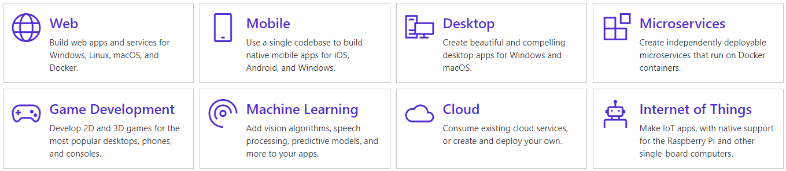
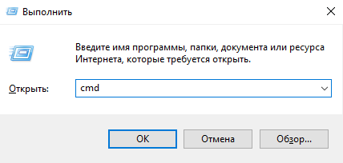
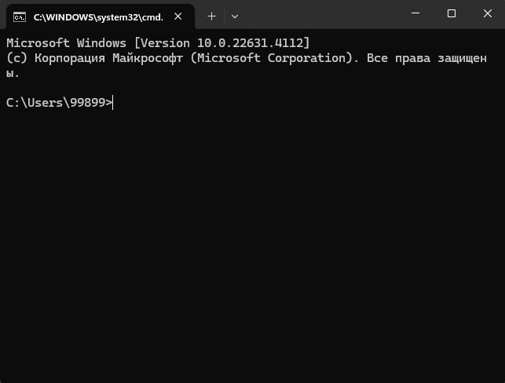

# .NET haqida

**.NET** kross platforma hisoblanib dasturchilar uchun IOT, Mobile, Desktop, Web, Game turdagi maxsulotlar ishlab chiqish uchun mo'ljallangan.

l

## **.NET ni yuklash**
Barcharga ma'lumki, .NET frameworklarining 3 turi hozirda faoliyatda. ".NET Framework", ".NET Core", ".NET5". Uchchala frameworkda ham SDK va Runtime bor. .NET SDK - dasturning qurilishi va ishga tushishini taminlaydi. .NET Runtime - Dasturning ishga tushishini taminlaydi xolos. Aytmoqchimanki, SDK o'zining ichiga Runtime ni ham oladi. Agar o'zining ichiga olsa nega kerak?

Barchamizga ma'lum .NET platformasida yozilgan ilovalarni ishga tushirish uchun .NET Runtime lari kerak bo'ladi. Bu sizga C++ emas. Istalgan kompyuterda ishga tushib ketaveradigan. Ya'ni Windows tizimi kompyuterga yangi o'rnatilgan paytda C++ Runtime lari bo'ladi. Shuning uchun C++ da yozilgan ilovalarni ishga tushirishda xech qanday so'rov bo'lmaydi. Mana endi sekin sekin Windowsning yangi versiyalarida .NET frameworklari ko'zga ko'rinyapti.

## **Hello World! (Hech qanday muhitsiz)**
Hamma tilda ishlash uchun muhit kerak bo'ladi. Huddi avvalgi mavzuda gapirgan Visual Studio yoki IntelliJ IDEA lar kabi. Aslida kodlar qanday quriladi. Amalga oshishi qanday bo'ladi? Qaysidir ma'noda bu jarayonni ham "Dasturlashda tafakkur" tushunchasiga misol qilsak bo'laveradi. Shunchi men o'zimni boshimdan o'tkazganman. Har xil savollar bo'ladida...

- Loyihamga nuget (paketlar menejeri) dan paket o'rnata olmayapman?
- Dasturni kompilatsiya qilib bo'lmayapti?
- Visual Studio dasturi meni kompyterimga tushmayapti?

Shunday savollarni ko'pini o'quvchilarimdan eshitganman. Ushbu gap so'zlardan keyin "Dasturlashda tafakkur" nomli qizg'in bir tushunchani kiritdim (o'zimni lug'atimga :). Agar bizning kodlarimiz qay tarzda build (qurilish) bo'lishini bilganimizda, bizga Visual Studio kerak emas edi. Kerak bo'lsa o'zimiz Visual Studio yaratgan bo'lardik. Qachonlardir C++ uchun yangi muhit qilgan edim C# orqali. Bu bilan nima demoqchiman? Keling "Hello World" natijani olish uchun visual studiodan kechib turamiz bir gal.... Demak boshladik.

## **.NET SDK ni o'rnatamiz.**
Avvalo .NET SDK ni yuklab olishimiz kerak bo'ladi [bu yerdan](https://dotnet.microsoft.com/en-us/download)

Visual Studio esa siz va .NET SDK o'rtasidagi vositachi xolos. Keling Visual Studioni ishini o'zimiz ham qilib ko'ramiz, vaziyatni baholash uchun. Hullas SDK ni yukladik, endi uni install qilamiz. Menimcha qiyinchilik tug'diymaydi. Agar xatolik bersa, demak avval .NET ning boshqa versiyasi ustanovka qilingan bo'ladi, o'shani o'chirib tashlab keyn buni install qlish kerak, agar lozim topsangiz. Menimcha boshqa xatolik yuz bermaydi. SDK o'rnaganini tekshirish uchun CMD ni ochamiz. buning uchun WIN+R klavishlari bosiladi va CMD deb yoziladi.

CMD ga "dotnet" deb yozish kifoya. Agar .NET SDK o'rnatilgan bo'lsa, ushbu kalit so'zni taniydi, aks holda bu so'z notanish deb inglizcha yoki ruscha gap chiqadi.

## ***Yangi loyiha yaratish***

Yangi loyiha yaratish uchun CMD ni orqali ushbu buyruqni ishga tushiring:

``dotnet new console -o MyApp``

So'ngra yangi yaratilgan MyApp direktoriyasiga qayting, uning uchun:

``> cd MyApp``

Barcha ma'lumotlar mana shu [saytdan](https://docs.dot-net.uz/) olindi.